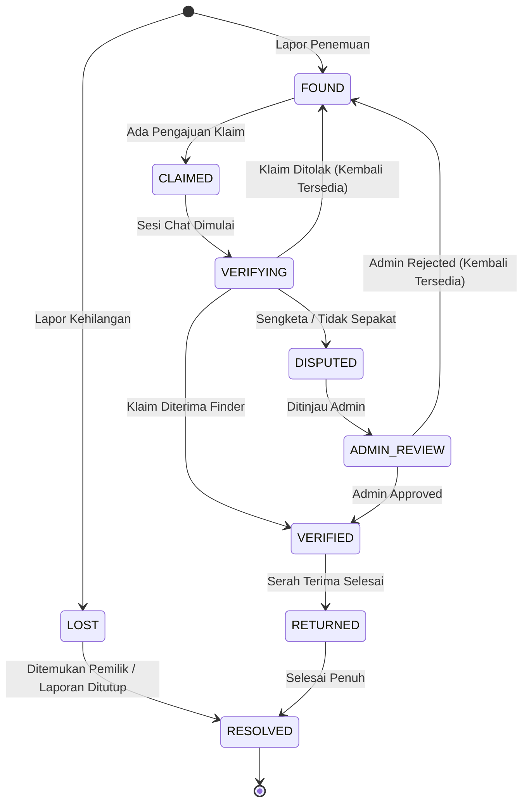

# 🧭 FINDLY — System Architecture & Workflow Specification
> **Dokumen Acuan Resmi Pengembangan Platform Campus Lost & Found**  
> *Versi 1.0 — Terakhir diperbarui: September 2026*

---

## 📌 Daftar Isi
1. [Konsep Dasar & Filosofi Sistem](#1-konsep-dasar--filosofi-sistem)
2. [Spesifikasi Role & Hak Akses Pengguna](#2-spesifikasi-role--hak-akses-pengguna)
3. [Alur Autentikasi & Keanggotaan](#3-alur-autentikasi--keanggotaan)
4. [Alur Navigasi & Halaman Publik](#4-alur-navigasi--halaman-publik)
5. [Alur Pelaporan: Saya Kehilangan (LOST)](#5-alur-pelaporan-saya-kehilangan-lost)
6. [Alur Pelaporan: Saya Menemukan (FOUND) & Secret Attributes](#6-alur-pelaporan-saya-menemukan-found--secret-attributes)
7. [Pencarian & Halaman Detail Barang](#7-pencarian--halaman-detail-barang)
8. [Alur Klaim & Verifikasi Peer-to-Peer (Chat)](#8-alur-klaim--verifikasi-peer-to-peer-chat)
9. [Protokol Mediasi Admin (Dispute Management)](#9-protokol-mediasi-admin-dispute-management)
10. [Alur Serah Terima (Handover) & Resolved](#10-alur-serah-terima-handover--resolved)
11. [State Machine & Siklus Status Sistem](#11-state-machine--siklus-status-sistem)
12. [Prinsip Keamanan & Privasi Data (Non-Negotiable)](#12-prinsip-keamanan--privasi-data-non-negotiable)
13. [Standar Kualitas & Larangan AI Slop (Development Standards)](#13-standar-kualitas--larangan-ai-slop-development-standards)
14. [Aturan Design System Findly (Design Tokens & UI Guide)](#14-aturan-design-system-findly-design-tokens--ui-guide)

---

## 1. Konsep Dasar & Filosofi Sistem

**Findly** adalah platform *Lost & Found* modern yang dirancang khusus untuk ekosistem kampus/universitas.

### 🎯 Tujuan Utama:
1. Pengguna dapat melaporkan barang hilang dengan detail lokasi dan ciri spesifik.
2. Pengguna (baik civitas kampus maupun masyarakat umum) dapat melaporkan barang temuan.
3. Pemilik dapat menelusuri katalog barang temuan/hilang.
4. Pemilik dapat mengajukan klaim kepemilikan atas barang yang ditemukan.
5. **Verifikasi Peer-to-Peer:** Penemu (*Finder*) dan pengaju klaim (*Claimant*) memverifikasi kepemilikan secara mandiri melalui ruang chat khusus.
6. **Mediasi Admin:** Admin **bukan verifikator harian**, melainkan mediator yang hanya turun tangan jika terjadi sengketa (*dispute*) atau kebuntuan.
7. Penemu dan pemilik menyepakati proses pengembalian secara aman di lingkungan kampus.
8. Sistem mencatat jejak audit seluruh proses hingga barang berstatus `RETURNED` / `RESOLVED`.

---

## 2. Spesifikasi Role & Hak Akses Pengguna

Sistem memiliki **3 Role Pengguna Terdaftar** dan **1 Status Pengunjung Tamu**:

| Role / Tipe | Deskripsi & Contoh | Data Registrasi / Identitas | Badge Tampilan |
| :--- | :--- | :--- | :--- |
| **1. Campus Member** | Mahasiswa, Dosen, Tenaga Pendidik, Karyawan internal kampus | Nama Lengkap, Universitas, Role, NIM / NoBP / NIP, Email, Password | `✓ University Verified` |
| **2. Community Member** | Pengunjung kampus, orang tua mahasiswa, vendor, satpam luar, masyarakat sekitar | Nama Lengkap, Email, Password *(Tanpa butuh NIM/NIP)* | `Community Member` |
| **3. Admin (Mediator)** | Pengelola platform, komite keamanan/tata tertib kampus | Akun tersentralisasi dengan hak akses dashboard moderasi | `🛡️ Staff / Mediator` |
| **4. Guest (Publik)** | Siapa pun yang membuka web sebelum melakukan autentikasi | Tanpa akun | *None* |

### Peran Dinamis dalam Transaksi:
Setiap pengguna terdaftar (baik Campus maupun Community) dapat berperan sebagai:
- **Finder (Penemu):** Orang yang mengunggah laporan barang temuan.
- **Claimant (Pengaju Klaim):** Orang yang mengaku sebagai pemilik sah dan meminta verifikasi atas barang temuan tersebut.

---

## 3. Alur Autentikasi & Keanggotaan

### A. Login Flow
* **Kredensial Login:** Login menggunakan **Email + Password**.
* **Ketentuan NIM:** NIM / NIP / NoBP **TIDAK** digunakan sebagai username/kredensial login, melainkan murni sebagai data identitas dan penentu badge verifikasi universitas.

```
[ Landing Page ] ──► [ Login Page ] ──► Masukkan Email + Password
                                                │
                                    ┌───────────┴───────────┐
                                    ▼                       ▼
                                 [ Sukses ]              [ Gagal ]
                                    │                       │
                                    ▼                       ▼
                            Masuk ke Dashboard       Tampilkan Error
```

### B. Sign Up Flow
1. Calon pengguna memilih tipe akun:
   - **Campus Member:** Mengisi Nama, Universitas, Role Kampus, NIM/NIP/NoBP, Email, Password. Status akun: `✓ University Verified`.
   - **Community Member:** Mengisi Nama, Email, Password. Status akun: `Community Member`.
2. Opsi alternatif pendaftaran cepat menggunakan Google OAuth (`Daftar dengan Google`).

---

## 4. Alur Navigasi & Halaman Publik

### A. Akses Tamu (Sebelum Login):
* Boleh menelusuri Landing Page dan katalog publik **Cari Barang**.
* **Proteksi Aksi:** Saat ingin melakukan tindakan berikut, pengguna **wajib login/daftar**:
  - `Ajukan Klaim`
  - `Simpan Barang` (Bookmark)
  - `Kirim Pesan / Chat`
  - `Buat Laporan Baru`

### B. Struktur Menu Setelah Login (Main User Area):

```
SIDEBAR UTAMA:
├── Beranda (Dashboard Overview)
├── Cari Barang (Search & Discovery)
├── Saya Kehilangan (Daftar Laporan Kehilangan Saya)
├── Saya Menemukan (Daftar Laporan Temuan Saya)
├── Klaim Saya (Status Pengajuan & Penerimaan Klaim)
├── Pesan (Chat Room Aktif)
├── Disimpan (Barang yang Ditandai)
└── Notifikasi

SIDEBAR BAWAH:
├── Akun Saya (Profil, Badge, Masked NIM)
├── Pengaturan
└── Bantuan & FAQ

HEADER:
├── Global Search Bar
├── Notification Bell
├── Quick Messages Dropdown
└── User Profile & Logout
```

---

## 5. Alur Pelaporan: Saya Kehilangan (LOST)

Digunakan ketika pengguna kehilangan barang miliknya.

```
[ Saya Kehilangan ]
       │
       ▼
[ Buat Laporan Barang Hilang ]
       │
       ├──► 1. Detail Barang (Nama, Kategori, Merek, Warna)
       ├──► 2. Upload Foto Barang (jika ada dokumentasi sebelumnya)
       ├──► 3. Lokasi & Waktu Terakhir Dilihat
       ├──► 4. Deskripsi & Ciri-Ciri Khusus
       │
       ▼
[ Review & Konfirmasi ]
       │
       ▼
[ Posting Laporan ➔ Status: LOST ]
```
*Setelah diposting, laporan muncul pada katalog publik pencarian.*

---

## 6. Alur Pelaporan: Saya Menemukan (FOUND) & Secret Attributes

> ⚠️ **ATURAN EMAS: BLIND VERIFICATION (SECRET ATTRIBUTES)**  
> Untuk mencegah penipuan dan klaim palsu, **JANGAN tampilkan semua detail barang temuan ke publik**.

### A. Pembagian Data Pelaporan:
1. **Informasi Publik (Ditampilkan di Katalog & Detail):**
   - Nama umum barang (Contoh: *Tas Ransel Hitam Nike*)
   - Kategori (Contoh: *Tas & Ransel*)
   - Lokasi ditemukan (Contoh: *Perpustakaan Pusat*)
   - Tanggal & waktu ditemukan
   - Foto tampak luar (tanpa mengekspos isi atau ciri unik tersembunyi)
2. **Informasi Rahasia / Secret Verification Data (Disimpan Sistem, Disembunyikan dari Publik):**
   - Ciri khusus tersembunyi (Contoh: *Ada gantungan kunci hitam, ada noda kecil di resleting depan, di dalam ada buku tulis tertentu*)
   - Informasi rahasia ini hanya boleh diakses oleh Finder di sesi chat untuk menguji kebenaran klaim pemilik.

---

## 7. Pencarian & Halaman Detail Barang

### A. Fitur Pencarian & Filter:
* **Pencarian Kata Kunci:** Berdasarkan nama barang, merek, atau deskripsi umum.
* **Filter Multifaset:**
  - Tipe Status: `Semua` | `Hilang (LOST)` | `Ditemukan (FOUND)`
  - Kategori: Elektronik, Dompet, Kunci, Tas, Dokumen/Kartu, dll.
  - Lokasi: Nama gedung, perpustakaan, fakultas, kantin, dll.
  - Rentang Tanggal
  - Kampus / Universitas

### B. Halaman Detail Barang:
* Menampilkan foto, nama, badge status (`LOST` / `FOUND`), lokasi umum, tanggal/waktu, dan identitas penemu/pelapor (dengan badge `✓ University Verified` atau `Community Member`).
* **Tombol Interaksi Utama:**
  - `Ajukan Klaim` (Khusus barang bertipe `FOUND`)
  - `Simpan Barang` (Bookmark)
  - `Bagikan Laporan` (Share Link)

---

## 8. Alur Klaim & Verifikasi Peer-to-Peer (Chat)

```
[ Detail Barang Temuan ]
           │
           ▼
    [ Ajukan Klaim ]
           │
           ├──► Mengisi Formulir Bukti Kepemilikan:
           │    1. Alasan kuat meyakini barang tersebut miliknya
           │    2. Kapan & di mana terakhir kali melihat barang
           │    3. Ciri-ciri khusus/rahasia yang ada di barang tersebut
           │
           ▼
    [ Submit Klaim ➔ Status: PENDING ]
           │
           ▼
[ Sistem Membuat Dedicated Chat Room: Finder ↔ Claimant ]
           │
           ▼
[ Proses Tanya-Jawab Pembuktian (Peer-to-Peer Verification) ]
           │
           ├─────────────────────────┬─────────────────────────┐
           ▼                         ▼                         ▼
   [ Accept Claim ]          [ Reject Claim ]       [ Dispute / Buntu ]
           │                         │                         │
     Status: VERIFIED        Status: REJECTED                  ▼
           │                                          [ Request Admin ]
           ▼                                                   │
  Masuk ke Pengembalian                                        ▼
                                                        Status: DISPUTED
```

### Keputusan Penemu (*Finder*):
1. **Accept Claim:** Finder puas dengan bukti claimant ➔ status klaim berubah menjadi `VERIFIED`.
2. **Reject Claim:** Penjelasan claimant salah/mencurigakan ➔ status klaim menjadi `REJECTED`.
3. **Request Admin Mediation:** Terjadi perdebatan, klaim ganda, atau ketidaksepakatan ➔ status menjadi `DISPUTED` dan diteruskan ke Admin.

---

## 9. Protokol Mediasi Admin (Dispute Management)

> 🛡️ **PERAN ADMIN:**  
> Admin **tidak** memvalidasi setiap klaim yang masuk. Admin **hanya** bertindak pada tiket yang berstatus `DISPUTED` / `ADMIN REVIEW`.

### Cara Kerja Mediasi Admin:
1. Admin menerima notifikasi adanya sengketa baru.
2. Admin membuka dashboard mediasi dan melihat:
   - Detail barang temuan beserta **Informasi Rahasia** yang dimasukkan finder.
   - Profil finder & profil claimant (beserta badge verifikasi kampus).
   - Seluruh histori pesan chat antara kedua pihak beserta timestamp.
   - Dokumen atau foto bukti tambahan yang diunggah claimant.
3. **Bergabung ke Ruang Chat yang Sama:** Admin masuk ke room chat yang sudah ada untuk bertanya atau memberi arahan (bukan membuka ruang terpisah).
4. **Putusan Admin:**
   - **ADMIN APPROVED:** Bukti claimant sah. Status klaim berubah menjadi `VERIFIED`, lanjut ke proses pengembalian.
   - **ADMIN REJECTED:** Klaim ditolak secara resmi. Barang tetap berstatus `FOUND` dan terbuka untuk klaim pihak lain.

---

## 10. Alur Serah Terima (Handover) & Resolved

Setelah klaim berstatus `VERIFIED` (baik disetujui langsung oleh finder maupun melalui mediasi admin):

```
[ Status Klaim: VERIFIED ]
           │
           ▼
[ Koordinasi Serah Terima (Handover) ]
           │
           ├──► Menyepakati waktu dan lokasi pertemuan
           ├──► Rekomendasi Findly: Bertemu di Pos Keamanan Kampus,
           │    Lobi Utama, atau Area Publik Kampus yang Terang & Aman
           │
           ▼
[ Barang Diserahkan Kembali ke Pemilik ]
           │
           ▼
[ Tombol: "Mark as Returned" Diklik ]
           │
           ▼
[ Status Akhir Barang: RESOLVED ]
```

> 🚫 **LARANGAN TEBUSAN (NO IN-APP RANSOM/FEES):**  
> Findly **TIDAK** menyediakan fitur pembayaran tebusan uang kepada penemu barang. Platform ini berasaskan gotong royong dan integritas komunitas kampus.

---

## 11. State Machine & Siklus Status Sistem

### A. Lifecycle Status Barang (Item Lifecycle)



---

## 12. Prinsip Keamanan & Privasi Data (Non-Negotiable)

Untuk menjaga rasa aman dan mencegah penyalahgunaan data:

### ❌ DILARANG DITAMPILKAN KE PUBLIK:
- Password / hash kredensial akun.
- NIM / NIP / NoBP secara lengkap (Wajib disensor, contoh: `•••••1234`).
- Nomor telepon/WhatsApp pribadi secara terbuka di halaman barang.
- **Secret Attributes (ciri rahasia)** dari barang temuan.
- Foto barang yang memperlihatkan dokumen sensitif (KTP, SIM, Kartu ATM).

### ✅ BOLEH DITAMPILKAN KE PUBLIK:
- Nama tampilan pengguna.
- Asal Universitas dan Role Kampus (*Mahasiswa / Dosen / Staff*).
- Status Badge Verifikasi (`✓ University Verified` atau `Community Member`).
- Foto barang tampak luar, nama barang, lokasi umum, tanggal, dan status barang saat ini.

---

## 13. Standar Kualitas & Larangan AI Slop (Development Standards)

Platform Findly dibangun dengan standar profesional tinggi. Seluruh tim pengembang dan asisten AI wajib mematuhi panduan kualitas berikut:

### 🚫 1. Larangan Aset Visual & Gambar "AI Slop"
* **Dilarang keras** menggunakan gambar atau ilustrasi hasil generate AI murahan yang memiliki distorsi visual (jari aneh, teks acak/gibberish, artefak buram, atau gaya 3D kartun generik yang tidak konsisten).
* Seluruh ilustrasi dan ikon wajib menggunakan aset grafis bersih, tajam, vektor/SVG presisi (misal: *Lucide Icons*), atau ilustrasi terkurasi yang harmonis dengan palet warna Findly (`#30AFFF`).

### 🚫 2. Larangan Copywriting Klise & Dummy Filler
* **Dilarang keras** menggunakan teks template robotik, *lorem ipsum* sembarangan, atau kalimat marketing klise AI (seperti *"Solusi sinergis revolusioner masa depan"*).
* Gunakan gaya bahasa Indonesia yang natural, lugas, ramah pengguna kampus (*relatable*), dan komunikatif. Semua label, pesan error, instruksi, dan placeholder harus fungsional dan masuk akal secara nyata.

### 🚫 3. Larangan Kode "Slop" & Lazy Boilerplate
* **Dilarang keras** menghasilkan kode malas (*lazy coding*): fungsi dummy tanpa implementasi, nesting komponen berlebihan, duplikasi logika (*spaghetti code*), atau penanganan error pura-pura (*swallowing errors* / `catch (e) {}` kosong).
* Setiap komponen wajib ditulis dengan **TypeScript ketat**, struktur modular yang bersih, state management yang efisien, dan integrasi nyata ke Supabase Auth & Database.

### ✨ 4. Presisi UI/UX & Detail Finishing
* Tampilan wajib pixel-perfect, memperhatikan whitespace, responsive di semua ukuran layar (mobile, tablet, desktop), serta memiliki mikro-interaksi halus (hover, focus ring, loading state).
* Menjaga konsistensi token desain (radius, warna primary `#30AFFF`, background band `#EEF7FF`, neutral slate text).

---

*Dokumen ini menjadi acuan mutlak (Single Source of Truth) bagi seluruh implementasi UI/UX, Skema Database Supabase, Business Logic API, dan Role-Based Access Control (RBAC) pada sistem Findly.*

## 14. Aturan Design System Findly (Design Tokens & UI Guide)

Dokumen ini mendefinisikan seluruh variabel desain, token visual, dan standar antarmuka pengguna (*UI/UX*) untuk platform Findly agar tercipta pengalaman visual yang konsisten, modern, dan bernilai estetika tinggi.

---

### 🔤 1. Tipografi (Typography)

* **Font Utama:** `Inter` (Google Font via `next/font/google`).
* **Font Fallback:** `-apple-system, BlinkMacSystemFont, "Segoe UI", Roboto, sans-serif`.
* **Karakter Tipografi:** Bersih, humanis, sangat terbaca (*high legibility*) di layar digital kampus.

| Kategori | Ukuran Tailwind | Line Height | Weight | Penggunaan Utama |
| :--- | :--- | :--- | :--- | :--- |
| **Display / Hero H1** | `text-3xl sm:text-4xl lg:text-[40px] xl:text-[44px]` | `leading-[1.2]` | `Bold (700)` | Judul utama landing page & hero banner |
| **Section Heading (H2)** | `text-2xl sm:text-3xl` | `leading-[1.3]` | `Bold (700)` | Judul seksi utama (*Fitur Utama, Cari Barang*) |
| **Card Title (H3)** | `text-base sm:text-lg` | `leading-[1.4]` | `SemiBold (600)` | Nama barang, judul kartu fitur, sub-menu |
| **Body Regular** | `text-sm sm:text-base` | `leading-relaxed` | `Regular (400)` | Paragraf deskripsi barang, instruksi teks |
| **Body Medium / Form** | `text-xs sm:text-sm` | `leading-normal` | `Medium (500)` | Input form, teks tombol, opsi dropdown |
| **Caption & Badge** | `text-[11px] / text-xs` | `leading-tight` | `Medium (500) / SemiBold (600)` | Badge status, timestamp, copyright, label kecil |

---

### 🎨 2. Palet Warna (Color Palette & Tokens)

#### A. Primary Brand Colors (Identitas Utama)
* **Primary Brand:** `#30AFFF` *(Sky Blue / Cyan Blue khas Findly)* — Digunakan untuk tombol utama, logo, active link, radio button, dan fokus interaksi.
* **Primary Hover:** `#2196E8` — State hover tombol dan elemen interaktif.
* **Primary Active / Dark:** `#1A85D6` — State tekan (*active/pressed*).
* **Primary Light / Surface Tint:** `#EFF8FF` atau `#EEF7FF` — Latar belakang band statistik, container icon fitur, dan highlight aktif.
* **Primary Focus Ring:** `rgba(48, 175, 255, 0.25)` — Efek ring fokus aksesibilitas form.

#### B. Neutral Colors (Monokrom & Background)
* **Background Utama:** `#FFFFFF` (Putih bersih).
* **Background Halaman Alternatif:** `#F4F7FB` atau `#F8FAFC` (Latar belakang seksi auth/dashboard).
* **Border Default:** `#E5E7EB` (Gray 200) atau `#F1F5F9` (Slate 100) — Garis pemisah halus dan border kartu.
* **Border Input Focus:** `#30AFFF`.
* **Text Primary (Headings):** `#111827` (Gray 900) — Teks judul yang tegas dan kontras tinggi.
* **Text Secondary (Body/Desc):** `#6B7280` (Gray 500) — Teks deskripsi dan panduan.
* **Text Muted / Placeholder:** `#9CA3AF` (Gray 400) — Placeholder form dan metadata non-kritis.

#### C. Status & Semantic Colors (Sistem Status Barang & Klaim)
Setiap status memiliki kombinasi warna teks, background lembut, dan border:

| Status Barang / Klaim | Hex Utama | Background Lembut | Border Warna | Contoh Komponen |
| :--- | :--- | :--- | :--- | :--- |
| **LOST (Hilang)** | `#EF4444` (Rose 500) | `#FEF2F2` (Rose 50) | `#FECACA` (Rose 200) | Badge laporan kehilangan |
| **FOUND (Ditemukan)** | `#10B981` (Emerald 500) | `#ECFDF5` (Emerald 50) | `#A7F3D0` (Emerald 200) | Badge barang temuan |
| **PENDING / VERIFYING** | `#F59E0B` (Amber 500) | `#FFFBEB` (Amber 50) | `#FDE68A` (Amber 200) | Badge klaim dalam proses chat |
| **DISPUTED** | `#8B5CF6` (Purple 500) | `#F5F3FF` (Purple 50) | `#DDD6FE` (Purple 200) | Tiket sengketa mediasi admin |
| **VERIFIED / RETURNED** | `#0EA5E9` (Sky 500) | `#F0F9FF` (Sky 50) | `#BAE6FD` (Sky 200) | Status serah terima berhasil |
| **RESOLVED** | `#10B981` (Emerald 600) | `#D1FAE5` (Emerald 100) | `#6EE7B7` (Emerald 300) | Kasus ditutup tuntas |

#### D. Badges Pengguna (User Identity Badges)
* **`✓ University Verified`**:
  - Background: `#EFF8FF` | Text: `#30AFFF` | Border: `#BFDBFE`
  - Ikon: Centang centang verified / Topi wisuda mini (`GraduationCap`).
* **`Community Member`**:
  - Background: `#F1F5F9` | Text: `#64748B` | Border: `#E2E8F0`
  - Ikon: User outline (`Users`).

---

### 📐 3. Sistem Radius & Sudut (Border Radius Hierarchy)

* **Small (`rounded-md` / 6px):** Badge status mini, chip filter kategori kecil.
* **Medium (`rounded-lg` / 8px):** Tombol CTA standar (*Ajukan Klaim, Sign Up*), kotak icon logo `F`.
* **Large (`rounded-xl` / 12px):** Input form (*Email, Password*), tombol auth sosial, icon container fitur.
* **Extra Large (`rounded-2xl` / 16px):** Kartu Fitur Utama, Card Item di katalog pencarian.
* **Super Large (`rounded-3xl` / 24px):** Container besar card login/register.
* **Full (`rounded-full`):** Avatar profil, pill tab selector, notification badge.

---

### 🌫️ 4. Elevasi & Efek Bayangan (Shadows & Depth)

* **Flat / Border-first:** Default antarmuka mengandalkan border tipis `#E5E7EB` / `#F1F5F9` daripada bayangan berat agar tampilan terlihat bersih dan modern (*clean minimalism*).
* **Subtle Shadow (`shadow-xs` / `shadow-sm`):** Digunakan pada kartu fitur dan tombol untuk memberi ketegasan klik.
* **Hover Lift (`hover:shadow-md hover:-translate-y-0.5`):** Efek mengambang mikro saat kursor diarahkan ke kartu barang atau kartu fitur.
* **Auth Modal Elevation (`shadow-[0_8px_30px_rgb(0,0,0,0.04)]`):** Bayangan luas tapi sangat lembut untuk memisahkan kartu form dari background halaman.

---

### ⚡ 5. Ikonografi (Iconography System)

* **Pustaka Resmi:** `lucide-react`.
* **Ketebalan Garis (Stroke Width):**
  - Standar: `strokeWidth={1.75}` (elegan, proporsional dengan font Inter).
  - Penekanan: `strokeWidth={2}` untuk badge kecil atau ikon aksi penting.
* **Ukuran Ikon Standar:**
  - Micro (dalam badge/metadata): `size={14}` atau `size={15}`.
  - Form Input & Buttons: `size={17}` atau `size={18}`.
  - Navigasi & Kartu Fitur: `size={22}` hingga `size={24}`.

---

### 🧩 6. Standar Komponen UI Inti (Core UI Components)

1. **Tombol (Buttons):**
   - *Primary:* Background `#30AFFF`, teks putih, hover `#2196E8`, shadow-sm, radius `rounded-lg` / `rounded-xl`.
   - *Secondary / Outline:* Border `#30AFFF`, teks `#30AFFF`, background transparan, hover `bg-blue-50/60`.
   - *Ghost / Link:* Teks `#6B7280`, hover `#111827`, tanpa border.
   - *Danger:* Background `#EF4444`, teks putih (untuk tolak klaim / laporkan penipuan).
2. **Input Fields:**
   - Background putih, border `#E2E8F0`, padding `py-2.5 px-3.5`, radius `rounded-xl`.
   - Focus state: `focus:outline-none focus:border-[#30AFFF] focus:ring-2 focus:ring-[#30AFFF]/20`.
   - Ikon pembantu di sisi kanan (misal: `Mail`, `Eye/EyeOff` password toggle) dengan warna `#9CA3AF`.
3. **Card Barang (Catalog Card):**
   - Border `#F1F5F9` / `#E2E8F0`, background putih, radius `rounded-2xl`, overflow-hidden.
   - Foto rasio 16:9 atau 4:3 di bagian atas dengan cover fill.
   - Badge status (`LOST` / `FOUND`) di sudut kiri atas foto.
   - Judul barang bold, lokasi dan tanggal dengan ikon pin & kalender kecil.
4. **Chat Bubbles (Sesi Verifikasi):**
   - *Pengirim (Anda):* Background `#30AFFF`, teks putih, rounded bubble dengan sudut kanan bawah tajam.
   - *Penerima:* Background `#F1F5F9`, teks `#111827`, rounded bubble dengan sudut kiri bawah tajam.
   - *Admin / Mediator Notice:* Background `#F5F3FF`, border `#DDD6FE`, teks `#6D28D9`, posisi tengah dengan ikon shield.

---

*Seluruh implementasi komponen UI di folder `app/` dan `src/components/` wajib merujuk secara patuh pada aturan Design System ini.*

